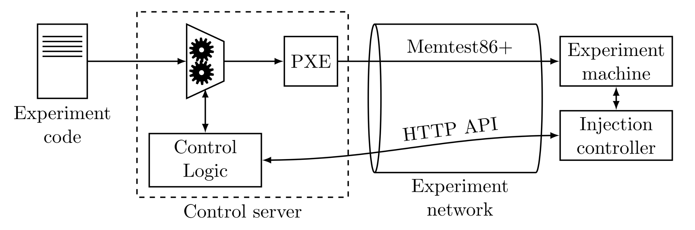
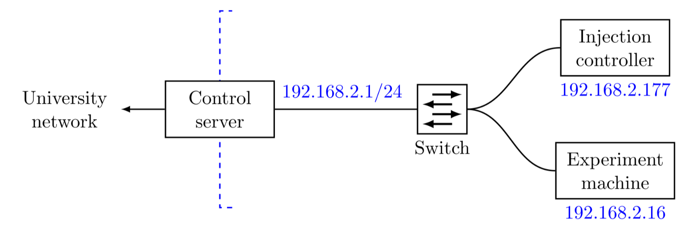

# Control Server
Configuration and scripts used on the control server which 
supervises the fault injection system.

## Setup
The setup has to be done only once. 
It was performed on Ubuntu 20.04, but should also work on
all Debian or Linux based systems with some modifications.
You only need shell/root access to the control server. The access
to the experiment machines doesn't matter, as we PXE boot them with
custom software.

### Hardware
You only need a single control server with a USB-to-Ethernet adapter
(or any other NIC), so it has two NICs in total, one for normal remote access,
one for the PXE network.
For `n` experiment machines, you need a network switch with at least `n` ports
and `n` injection controllers.
You may also want `n` external GPUs, as those seem to lead to fewer crashes.
Connect all the experiment machines, the injection controllers and the
control server to the switch of the experiment network.

### Network setup
We decided to use a separate network on the `192.168.2.0/24` subnet.
For this, we used a USB-to-Ethernet adapter to have a separate 
network interface on the machine.
In our experience, the Linux kernel supports many such adapters quite well out 
of the box.
To setup the interface, we set up a static IP.
For this, we added the following entries into the root users crontab
using `sudo crontab -e`
~~~
@reboot ip link set enx00e04f6b9489 up
@reboot ip addr add 192.168.2.1/24 dev enx00e04f6b9489
~~~
You can also run these commands manually (without the `@reboot`).
The interface name can be checked when it is plugged in, using `dmesg`.
Make sure the interface is UP. If it is down:
~~~
sudo ifconfig enx00e04f6b9489 up
~~~
and also make sure the routes are properly configured.
You can use
~~~
sudo ip route add 192.168.2.0/24 dev enx00e04f6b9489
~~~
At this point you should be able to ping the injection controllers.
Their IPs are hard-coded in the firmware and should be written on the
bottom of the PCB.

### Dnsmasq
Dnsmasq is used as a PXE server, as it intergrates a DHCP and TFTP server.
First, install the package.
~~~
sudo apt-get install dnsmasq
~~~

Use the configuration file `dnsmasq.conf` and put it in `/etc/dnsmasq.conf`.
You may have to adapt the interface name if yours isn't `enx00e04f6b9489`.
This configuration file disables DNS and configures a DHCP range
in the `192.168.2.0/24` subnet. It is also binding exclusively to 
a specified interface.

If everything is set up correctly, the PXE server should serve 
`/var/ftpd/<MAC-ADDR>/memtest_pxe` to connected clients.
For this, create the appropriate directories named after the dash-separated,
lower-case MAC addresses of the experiment machines.
Create symlinks with the node name, so the scripts can address them.
Make sure everything is writeable by an unprivileged user, so the script
can copy the images there without requiring sudo (e.g., `chmod 777 -R /var/ftpd`).
~~~
drwxrwxrwx  2 stgloor domain users 4096 Jan 16 22:35 74-56-3c-41-6c-c6
lrwxrwxrwx  1 stgloor domain users   18 Jan 20 20:46 cn118 -> d8-5e-d3-e2-2d-1f/
lrwxrwxrwx  1 stgloor domain users   18 Jan 16 22:34 cn126 -> 74-56-3c-41-6c-c6/
drwxr-xr-x  2 stgloor domain users 4096 Jan 20 20:51 d8-5e-d3-e2-2d-1f
~~~

Now, the service can be started.

~~~
sudo systemctl enable dnsmasq
sudo systemctl start dnsmasq
~~~

Activities are logged to `/var/log/dnsmasq.log`.
At this point, it is also advisable to set up log rotation for this file.

Make sure PXE Boot and IPv4 stack is enabled on the experiment machine.
For troubleshooting, Wireshark might be well suited.

### Firewall
To open up the necessary ports for the server, the following 
commands can be run
~~~
firewall-cmd --permanent --zone=public --add-service=tftp 
firewall-cmd --permanent --zone=public --add-service=dhcp
~~~

Alternatively, it should also be possible to directly configure
nftables or iptables.

### Microcontroller
As the Teensy microcontroller does not use DHCP and is also set up 
with a static IP, we can add the following entry to `/etc/hosts`
~~~
192.168.2.177 inj-ctrl-cn115.localdomain
~~~
With this, we can communicate to the injection controller using 
this hostname. Repeat this for every node.

## Experiments
See the README in `experiments`.

## Scripts
The scripts are designed to automate some procedures of experiments,
such as communication with the injection controller.
See the README in `scripts`.
