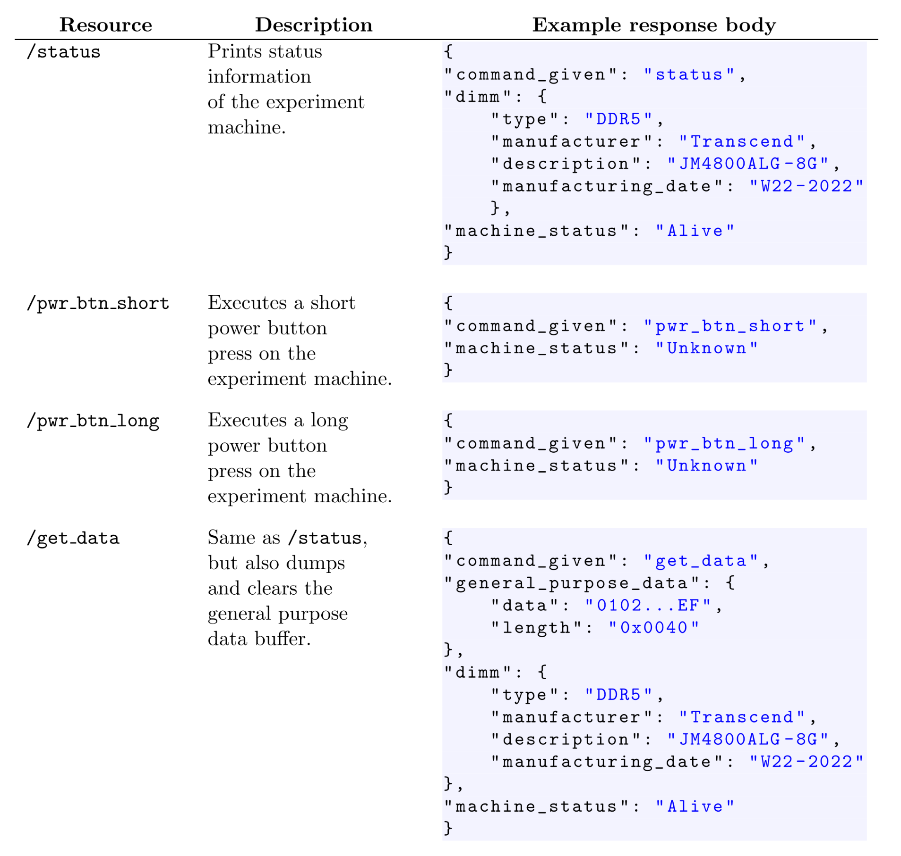

# Scripts
These scripts are building blocks or skeletons to implement specific 
experiments. See `../experiments` for details.
The purpose of each script is documented in the header of the each file,
mostly they are wrappers for the HTTP API of the injection controller.

To use several injection controllers in parallel, we use `/etc/hosts` to link
injection controller hostnames `inj-ctrl-$NODE.localdomain` with IPv4 addresses.
Scripts take in $NODE (i.e., cn115) as a positional argument.
